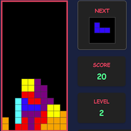
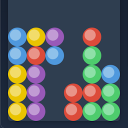
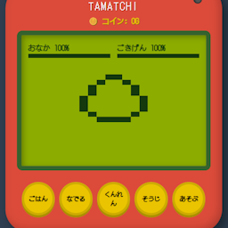

# Games

  

    <a href="/Experiments/games/tetris.html">
      
      <h3>Tetris</h3>
    </a>
  

  

    <a href="/Experiments/games/puyo.html">
      
      <h3>Puyo-puyo</h3>
    </a>
  

  

    <a href="/Experiments/games/tamacchi1.html">
      
      <h3>たまっち</h3>
    </a>
  

# Educational?

- [漢字を探せ（ウォーリーではない）](https://hokutoengineering.github.io/Experiments/games/randomKanji.html)
- [漢字ビンゴ](https://hokutoengineering.github.io/Experiments/games/kanjiBingo.html)

# More Educational?

- [MLPがどのように学んでいるかの可視化](https://hokutoengineering.github.io/Experiments/games/mlp_training.html)
- [CNNがどのように学んでいるかの可視化](https://hokutoengineering.github.io/Experiments/games/cnn_visualization.html)
